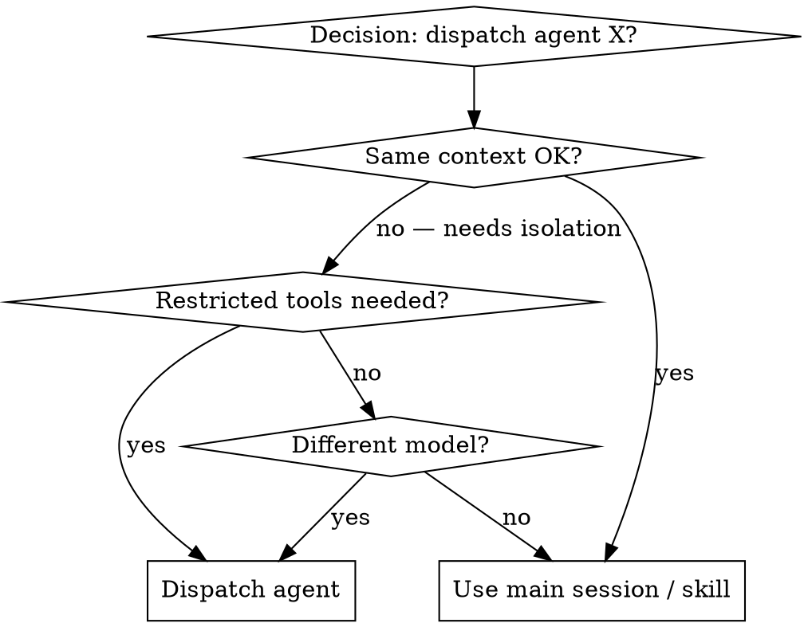

# Writing Agents

## Overview

**Writing agents IS Test-Driven Development applied to subagent definitions.**

You write test cases (pressure scenarios with dispatch), watch them fail (baseline behavior of a generic subagent), write the agent (frontmatter + persona + output contract), watch tests pass (new agent complies and stays in role), and refactor (close loopholes that let it drift, escalate beyond its tools, or violate responsibility boundaries).

**Core principle:** If you didn't watch a generic subagent fail at the task without your new agent definition, you don't know if your agent teaches the right thing.

**REQUIRED BACKGROUND:** You MUST understand `superpowers:test-driven-development` and `writing-skills` before using this skill. TDD defines the RED-GREEN-REFACTOR cycle; `writing-skills` adapts it to skill documentation. This skill is the same adaptation, applied to subagent `.md` files — covering both the *discipline* (TDD, anti-patterns, rationalizations) AND the *procedural workflow* (intent capture → frontmatter → body → write → validate → iterate).

**Official guidance:** For Anthropic's subagent recommendation patterns, see `claude-automation-recommender/references/subagent-templates.md`. For local normative rules — `bobs-plugin/references/agent-skill-best-practices/CONSTITUTION.md` (공통 헌법) + `AGENT-GUIDE.md` (에이전트 작성 규칙 전문). Quick rule-ID index: `bobs-plugin/skills/harness-resource-design/references/guide-rule-map.md`.

## What is an Agent?

A **subagent** is a specialized Claude instance with its own context window, its own tool allowlist, and (usually) its own model selection. The orchestrator dispatches it on a focused task and receives a structured result.

**Agents are:** Specialized roles — review, audit, generation, analysis. Each has a single responsibility, a tool/model contract, and a persona body that frames how it thinks.

**Agents are NOT:**
- A way to run scripts (use Bash directly)
- A way to encapsulate a procedure (use a skill)
- An orchestrator of other agents (orchestration belongs to the main session or a skill)
- A multi-step pipeline in one file (split the pipeline; let the caller assemble)

## Why agents differ from skills

| Skill | Agent |
|---|---|
| Lives in the caller's context | Has its own isolated context |
| Loads into Claude's working memory | Dispatched, returns structured result |
| Trigger via `Skill` tool or `/slash` | Dispatched via `Agent` tool / `subagent_type` |
| No tool boundary of its own | Tool allowlist is the safety boundary |
| Persona starts: noun phrase | Persona starts: "You are…" |
| Body 250–700 words typical | Body 250–700 words typical |
| Discipline lives in body prose | Discipline lives in body **and** tools/model **and** Output Guidance contract |

This means agents have *more* surface area for getting it wrong — and TDD has *more* value here, not less.

## TDD Mapping for Agents

| TDD Concept | Agent Creation |
|---|---|
| **Test case** | Pressure scenario — dispatch on a hard prompt and observe |
| **Production code** | Agent `.md` (frontmatter + persona + Output Guidance) |
| **Test fails (RED)** | Generic subagent (no custom agent) drifts, hallucinates role, escalates tools, or produces unparseable output |
| **Test passes (GREEN)** | New agent stays in role, respects tool boundary, returns expected contract |
| **Refactor** | Close loopholes the agent finds — "I had to use Write because the task required it", "I dispatched another agent because you implied parallelism" |
| **Write test first** | Run baseline (generic subagent) BEFORE writing the agent |
| **Watch it fail** | Document exact drift patterns — what role did it improvise, what tool did it reach for, what contract did it violate |
| **Minimal code** | Write agent addressing those specific drifts |
| **Watch it pass** | Re-dispatch and verify the new agent now stays in role |
| **Refactor cycle** | Find new drift → patch persona / tighten tools / sharpen Output Guidance → re-verify |

The entire agent creation process follows RED-GREEN-REFACTOR.

## When to Create an Agent

**Create when:**
- The task needs *isolated context* — long exploration / large file reads should not pollute the main session
- The task needs *restricted tools* — a reviewer must not have Write
- The task needs a *different model* — opus for migration, haiku for simple classification, while main runs sonnet
- The task happens *in parallel* with other work and benefits from independent dispatch
- A specialist persona ("security reviewer", "PR comment writer") materially changes output quality

**Don't create for:**
- One-shot scripts (use Bash)
- Procedures the main session can follow directly (use a skill)
- Catch-all "general helper" roles (built-in `general-purpose` already fills this slot)
- Roles you cannot describe in a single sentence — that's a sign of two roles in one file
- Anything that needs to call another agent (the caller orchestrates, not the agent)

## Capturing Intent

Before drafting, lock down six things. If the user request is terse, ask them in a single grouped question. If the user says "don't ask, proceed", make reasonable defaults and call them out in the body's first line.

| # | Question | Influences |
|---|---|---|
| 1 | What's the one-sentence responsibility? | Persona + single-responsibility (A-M4 / §7.1) |
| 2 | When should it be invoked? 1–3 trigger phrases. | `description` "Use when …" |
| 3 | When should it NOT be invoked? At least one negative case. | `description` "Do NOT use for …" (A-M3) |
| 4 | What's the output, and what will the caller do with it? | Output Guidance + tool allowlist |
| 5 | Which files / systems does it touch? | `tools`: read-only / +Write / +Bash (A-S1~A-S3) |
| 6 | Where does it live? user / project / plugin? | Path decision (see Where to Put the File below) |

**Single-responsibility check:** the same agent must not *analyze + auto-fix + commit + push* (A-X1). Multi-step pipelines are orchestrated by the caller (skill or main session), not by one agent.

### In-flight escape hatches

If filling in the answers reveals a different resource shape, redirect *before* drafting:

- "This is a procedure / knowledge encapsulation, not an isolated persona" → use a skill (`writing-skills` / upstream `skill-creator`).
- "This needs to fire on every event deterministically" → use a hook (see `harness-resource-design`).
- "The user wants a design decision — merge two agents, decide migration order, split a responsibility" → use `agent-skill-designer`.
- "The user wants a static audit of an existing agent" → use `agent-skill-auditor`.

A one-line "redirecting because …" message to the caller is sufficient. Don't write the agent first and discover at validation that it was the wrong shape.

## Agent Types

### Review / Audit
Read-only. Finds issues, never fixes. Reports confidence + severity. Examples: `agent-skill-auditor`, `pr-review-toolkit:silent-failure-hunter`.

### Generation
Writes files. Templates, scaffolds, code. Examples: `feature-dev:code-architect`. Has Write/Edit but usually not Bash unless it must run validators.

### Analysis / Research
Explores codebase, returns synthesis. Read + Grep + Glob, sometimes Bash for metric collection. Examples: `Explore`, `feature-dev:code-explorer`.

### Specialist Reviewer
Domain-narrow review (security, performance, accessibility). Read-only, opinionated persona. Examples: `pr-review-toolkit:type-design-analyzer`.

### Orchestration
Rare. Almost always a skill is the right answer. If you find yourself writing an "orchestrator agent" that dispatches other agents — stop. Move the orchestration to the caller (skill or main session). See anti-pattern below.

## Where to Put the File

```
agents/
  agent-name.md       # The whole agent (frontmatter + persona body)
```

Three scopes — choose the narrowest that fits:

| Scope | Path | When |
|---|---|---|
| user | `~/.claude/agents/<name>.md` | Used across every project on your machine |
| project | `<repo>/.claude/agents/<name>.md` | Repo-specific |
| plugin | `plugins/<plugin>/agents/<name>.md` | Distributed as a plugin (callers see `<plugin>:<name>`) |

**Name collision check (run before drafting body):**

```bash
ls ~/.claude/agents/ <project>/.claude/agents/ plugins/*/agents/ 2>/dev/null
```

If the chosen name collides with a built-in (`general-purpose`, `Explore`, `Plan`) the orchestrator's routing becomes ambiguous — rename. If a same-name or same-responsibility agent already exists, the right move is usually to *update it*, not add a sibling.

Agents don't bundle references or scripts the way skills do — if the agent needs reference material, the *caller* loads it and passes it in the dispatch prompt, OR the agent reads it from a known path at run time. If a single role grows large enough to need bundled reference material, that's a strong signal it should be a *skill* instead, with the agent reduced to a thin dispatch wrapper.

## Agent .md Structure

**Frontmatter (YAML):**

| Field | Required | Notes |
|---|---|---|
| `name` | yes | kebab-case verb-noun. Reads naturally as `Agent({subagent_type: "<name>"})`. |
| `description` | yes | First line = *when to invoke*. Includes ≥1 explicit negative case (`Do NOT use for …`). 20–60 words typical, ≤300 for trigger-ambiguous domains, hard ceiling 500. |
| `model` | yes (effectively) | `sonnet` default; `opus` for migration / architecture / complex reasoning; `haiku` for simple classification; `inherit` only for caller-coupled helpers. Omitting it is non-deterministic. |
| `tools` | yes for non-catch-all | Explicit allowlist. Read/Grep/Glob for audit-class; +Write/Edit for generation; +Bash for infra. `tools: *` is the All-Tools antipattern. |
| `color` | optional | Visual grouping of related agents. |

```yaml
---
name: pr-comment-reviewer
description: Use when reviewing a PR's diff and the user wants a Korean comment-style report without auto-applying fixes. Do NOT use for full multi-agent PR reviews (use `pr-review-toolkit:review-pr`) or external model second opinions (use `codex-reviewer`).
tools: Read, Grep, Glob, Bash
model: sonnet
color: blue
---
```

**Body:**

```markdown
You are a [role] who [single-sentence responsibility].

## Core Process

1. **[Step 1]** — [why this step matters; what failure mode it prevents]
2. **[Step 2]** — [same]
3. **[Step 3]** — [same]

## Output Guidance

[Concrete shape the caller can parse. Tables work well.]
- For review/audit: severity + confidence ≥80 gate + file:line + 1-line evidence.
- For generation: file path + diff summary + follow-ups.
- Always include an escalation contract — what does the agent do when input is insufficient? (Typically: emit `NEEDS_INPUT: <reason>` and stop, never bother the user.)

## When to invoke (optional — only if trigger ambiguous)

<example>
Context: [situation]
Caller: [agent-name with input]
Output: [expected shape — keep one line]
</example>
```

## Claude Search Optimization (CSO) — for descriptions

**Critical for routing:** The orchestrator decides which agent to dispatch based on description. Make it answer: "Should I dispatch this agent right now?"

### 1. Description = When to Use, NOT What the Agent Does

The same trap as skills (writing-skills §CSO). If your description summarizes the agent's workflow, the orchestrator may pattern-match and dispatch even when the situation is wrong.

```yaml
# ❌ BAD: Summarizes workflow — looks attractive in catalog
description: Reviews PRs by reading diff, checking conventions, generating Korean comments, posting via gh

# ❌ BAD: Description-as-runbook
description: 1) Read diff 2) Classify severity 3) Write Korean comments 4) Post

# ✅ GOOD: Just triggering conditions + negative case
description: Use when the user wants Korean-only review comments on a PR's diff without auto-fixes. Do NOT use for full multi-agent PR reviews (use `pr-review-toolkit:review-pr`).
```

### 2. Negative cases are non-negotiable for agents

Skills mostly compete for invocation slots; agents compete *and* hand off. A missing negative case is how `agent-skill-auditor` gets dispatched for design questions, or `agent-skill-designer` for static rule audits. List the nearest siblings by name.

### 3. Keyword coverage

Concrete triggers users actually say. For agents, include:
- The role's domain ("security", "accessibility", "type design")
- The artifact ("PR", "migration", "OpenAPI spec")
- Synonyms ("review", "audit", "검토", "감사")

### 4. Descriptive naming

Verb-first kebab-case, reads well as `subagent_type` parameter:
- ✅ `code-reviewer`, `type-design-analyzer`, `silent-failure-hunter`
- ❌ `reviewer1`, `helper`, `agent-for-prs`

## Tool/Model Boundaries Are Discipline

For skills, the discipline lives in the prose. For agents, half the discipline lives in `tools:` and `model:`.

| Role | tools | model |
|---|---|---|
| Audit / review | `Read, Grep, Glob` (+ `Bash` for measurement only) | `sonnet` |
| Generation | + `Write, Edit` | `sonnet`, `opus` for architecture |
| Migration / infra | + `Bash` | `opus` |
| Catch-all (built-in only) | `*` | varies |

**The anti-pattern**: read-only persona body + `tools: *` is the most common drift. The body says "you do not modify files" and the agent has Write in its hands; under pressure it will use it. Tighten the allowlist; let the boundary be enforced by tooling, not by hope.

`model: opus` on every agent — Always-Opus — is the second most common drift. It looks safer ("more capable, why not?") but compounds latency and cost across an orchestrated pipeline. Sonnet first; promote to opus only when the role demonstrably needs deeper reasoning.

## Flowchart Usage



Use flowcharts only for non-obvious decisions. Tables, lists, and prose carry everything else.

## One Excellent Example > Many Mediocre

When showing how to write an agent, pick **one** real role and walk it end to end — frontmatter, body, Output Guidance, audit feedback, fix.

Don't:
- Demonstrate the same role in three languages
- Build a fill-in-the-blank template with `[BRACKET]` placeholders for every line
- Invent a contrived "FooBar Agent" — use a real role the reader will actually need

## File Organization

### Self-contained agent
```
agents/
  agent-skill-auditor.md
```
All discipline inline. Default choice.

### Agent + reference (rare)
```
agents/
  some-domain-reviewer.md
references/
  some-domain-checklist.md
```
Only when the reference is large enough that pasting it into every dispatch prompt is wasteful. The agent body says `Read ${CLAUDE_PLUGIN_ROOT}/references/some-domain-checklist.md` at run time. Most agents do not need this — they pull context from the dispatch prompt.

### Multiple agents sharing references
Move the references to a plugin-level `references/` and have each agent point to them.

## The Iron Law

```
NO AGENT WITHOUT A FAILING BASELINE FIRST
```

Same shape as TDD. Same shape as writing-skills.

Before writing the agent, dispatch a generic subagent (no custom `subagent_type`, just `Agent({prompt: …})`) on the prompt you want the new agent to handle. Watch what it does:
- What role did it improvise?
- Did it stay focused, or wander?
- Did it use tools you'd want forbidden?
- Did it produce parseable output, or prose blob?
- Did it dispatch another subagent? (orchestration drift)

Document the failures verbatim. Those failures are your test cases. The agent body and frontmatter must address *those specific failures* — not hypothetical ones, not "good practices in general."

Write agent before baseline? Delete the agent. Start with baseline.

**No exceptions:**
- Not for "simple roles"
- Not for "just adding a section"
- Not for "obvious from the description"
- Don't keep untested drafts as "reference"
- Delete means delete

## Testing All Agent Types

Different roles need different tests. See `testing-agents-with-subagents.md` in this directory for the full methodology, pressure scenario library, and rationalization table examples.

### Audit / review agents
**Test with:** Inputs designed to lure the agent into fixing — code with obvious bugs, files with low-hanging refactors. The agent must report and stop, not patch.
**Success:** Reports findings, refuses to fix even when fix is trivial, escalates `NEEDS_INPUT` rather than guessing.

### Generation agents
**Test with:** Underspecified prompts that tempt scope creep. A prompt asking for one component should not produce a whole feature.
**Success:** Produces exactly the requested artifact, lists follow-ups instead of doing them.

### Analysis / research agents
**Test with:** Questions with multiple plausible answers. Cases where summarizing requires judgment.
**Success:** Names the evidence it consulted, marks confidence, refuses to over-claim.

### Specialist reviewers
**Test with:** Diffs that include domain-relevant *and* domain-irrelevant issues. The agent should comment only on its domain.
**Success:** Stays in lane. Doesn't drift into general code review.

## Validation Workflow

After GREEN passes, run these three in order. Skip 2 / 3 only when the user explicitly opts out.

### 1. Static audit (mandatory)

Dispatch `bobs-plugin:agent-skill-auditor`:

```
paths=<absolute path to the new .md>
```

Expected: `AUDIT_SUMMARY` + `FINDINGS` + `METRICS`. **P0 / P1 are blockers** — fix and re-audit. **P2 is informational** — report to the caller, defer decision.

The auditor catches frontmatter and word-count issues; it does NOT test behavior under pressure. That's step 3.

### 2. Trigger accuracy (optional)

If the description's trigger keywords overlap with sibling agents (e.g., "review", "analyze"), run a should-trigger/should-not-trigger sweep — 20 queries via the `skill-creator` description-optimization loop. Skip when triggers are clearly distinct or budget-constrained.

### 3. Sanity dispatch (recommended for generation agents)

Dispatch the new agent on a representative prompt:

```
Agent({
  subagent_type: "<plugin-prefix>:<name>",  // plugin-scoped, e.g. "bobs-plugin:my-agent"
  // OR: "<name>"                            // user/project-scoped
  prompt: "<representative task>"
})
```

Verify: stays in role, respects tool boundary, returns parseable output, does NOT dispatch other agents. Review-class agents can usually ship after a passing static audit; generation-class agents should sanity-dispatch at least once.

## Common Rationalizations

| Excuse | Reality |
|---|---|
| "The role is obvious from the description" | Obvious to you ≠ obvious to a fresh subagent under pressure. Test it. |
| "It's just a wrapper around `Read`" | Wrappers drift. The dispatch surface is exactly where invariants break. |
| "I don't need to baseline — I already know what generic will do" | You don't. Baseline reveals the *exact* failure phrases you'll patch. |
| "Testing two agents takes time" | Not testing them costs *production* time when the agent gets dispatched wrong. |
| "I'll add tests later" | Later = never. Test before merging the agent file. |
| "The auditor already passed" | Static audit catches frontmatter and word-count issues. It does not test behavior under pressure. |
| "It's just a small frontmatter change" | Frontmatter changes change *dispatch routing* and *tool boundaries*. Re-baseline. |

**All of these mean: dispatch on a real prompt and observe behavior. No exceptions.**

## Bulletproofing Agents Against Rationalization

Agents that enforce discipline (read-only reviewers, no-auto-fix auditors, no-dispatch sub-agents) need to resist the model's own helpfulness pressure. The model wants to be useful; if it can fix the bug it found, it will.

### Close every loophole explicitly

State the rule *and* forbid the workaround:

<Bad>

```markdown
This agent does not modify files.
```

</Bad>

<Good>

```markdown
This agent does not modify files. Specifically:
- Do NOT call `Edit`, `Write`, or `Bash(git …)`.
- Even if a fix is one line and clearly correct, report it. Do not apply it.
- Do not "stage" a suggested patch as code blocks formatted for direct paste — that incentivizes the caller to apply work the agent disclaimed.
- If the caller asked you to fix, refuse with `OUT_OF_SCOPE: this agent reports only; apply via <suggested resource>.`
```

</Good>

### Address "spirit vs letter"

Add the foundational sentence near the top:

```markdown
**Violating the letter of these rules is violating the spirit of these rules.**
The model that crafts a code block "for the user's convenience" has applied the fix. Refusing means refusing to produce the patch.
```

### Build a rationalization table from your baseline

Every excuse the generic subagent made during RED goes into the table — verbatim. Future dispatches see the excuse + the counter and route around it.

### Negative-case routing in description

Add the names of nearby agents to the description so the orchestrator routes correctly:

```yaml
description: Use when …. Do NOT use for [thing that looks similar] — use `<other-agent>`.
```

This is more effective than prose; the catalog is what the orchestrator pattern-matches on.

## RED-GREEN-REFACTOR for Agents

### RED: Baseline (Watch It Fail)

Dispatch a generic subagent with the prompt you want the new agent to handle. Document:
- Role it improvised
- Tools it reached for
- Output shape (parseable? matches your intent?)
- Whether it dispatched further agents (orchestration drift)
- Verbatim rationalizations when it crossed a line

Save the transcript. You'll cite specific phrases in the persona body to address them.

### GREEN: Write Minimal Agent

Frontmatter:
- `name`, `description` (trigger + ≥1 negative), `tools` (the allowlist that prevents the RED tool drift), `model`.

Body:
- Persona ("You are …")
- Core Process — the steps the agent must follow, with *why* each prevents the corresponding RED failure
- Output Guidance — the shape that fixes the RED unparseable output
- (Optional) When-to-invoke `<example>` — only if trigger ambiguous

Re-dispatch on the same RED prompt. Agent should now stay in role, respect tools, produce parseable output.

### REFACTOR: Close Loopholes (Stay Green)

The first GREEN run will probably still surface some drift — the model finds new excuses. Each new excuse goes into:
1. The negation list in the body ("do not X, even when Y")
2. The rationalization table
3. (If the failure mode is dispatch-time, not run-time) the negative cases in `description`

Re-dispatch until the agent passes the full pressure-scenario set. See `testing-agents-with-subagents.md` for pressure scenario design (time pressure, sunk cost, helpfulness, authority).

## Anti-Patterns

### ❌ All-tools agent
`tools: *` on a review agent. Body says read-only; tools say otherwise. Under pressure, tools win.
**Fix:** Allowlist the exact tools. `Read, Grep, Glob` is a four-second edit.

### ❌ Always-opus
Every agent set to `opus`. Cost and latency compound across pipelines.
**Fix:** `sonnet` is the default. Promote per-role only on demonstrated need.

### ❌ Orchestrator agent
Agent body dispatches other agents. Debugging becomes impossible — you have a tree of contexts, none of which know the others' state.
**Fix:** Move orchestration to the caller (skill or main session). The agent does one thing.

### ❌ Description-as-runbook
Description summarizes the body. Orchestrator routes by description alone and skips the body.
**Fix:** Description = trigger + negatives. Body holds the workflow.

### ❌ Persona drift mid-body
Body starts "You are a security reviewer" and three sections later asks the agent to "consider whether the design is correct." Two responsibilities, two agents.
**Fix:** Split. One persona per file.

### ❌ Auto-merge generator
Agent generates code *and* commits *and* pushes. Three roles in one. Failure modes compound: a wrong commit on the wrong branch is hard to roll back.
**Fix:** Generator agent emits a diff. Caller decides whether to apply. Caller decides whether to commit.

### ❌ No negative case
Description has only positive triggers. Orchestrator can't tell the agent apart from its siblings.
**Fix:** At least one `Do NOT use for …` clause naming the sibling.

### ❌ Multi-language persona
Persona body switches between languages mid-section. Output formatting becomes unpredictable.
**Fix:** Pick one. Bilingual triggers in description are fine; bilingual body is not.

## STOP: Before Moving to Next Agent

**After writing ANY agent, you MUST STOP and complete the deployment process.**

**Do NOT:**
- Create multiple agents in a batch without testing each
- Move to the next agent before the current one passes baseline + pressure tests
- Skip testing because "agents are small" — agents have *more* contract surface than skills

**The checklist below is mandatory per agent.**

Deploying an untested agent = deploying an untested service. Every dispatch is a production call.

## Agent Creation Checklist (TDD Adapted)

**Create TodoWrite todos for each item.**

**RED — Baseline:**
- [ ] Identify 1–3 representative prompts the new agent should handle
- [ ] Dispatch generic subagent on each — no `subagent_type`
- [ ] Document role drift, tool drift, output drift, dispatch drift, verbatim rationalizations
- [ ] Identify pattern across failures

**GREEN — Write Minimal Agent:**
- [ ] `name` kebab-case, reads naturally as `subagent_type`
- [ ] `description` starts with *when to invoke*; ≥1 negative case naming a sibling
- [ ] `description` is third-person, ≤500 chars, no workflow summary
- [ ] `tools` allowlist matches the role (audit / generation / infra)
- [ ] `model` explicit (sonnet / opus / haiku / inherit)
- [ ] Body persona starts "You are …" with a one-sentence responsibility
- [ ] Core Process explains *why* each step is necessary, addressing the RED drifts
- [ ] Output Guidance specifies parseable shape + escalation contract (`NEEDS_INPUT` / `OUT_OF_SCOPE`)
- [ ] One excellent example if trigger ambiguous; otherwise omit
- [ ] Run static audit (`bobs-plugin:agent-skill-auditor`) — P0/P1 = 0
- [ ] Re-dispatch on RED prompts — agent stays in role

**REFACTOR — Close Loopholes:**
- [ ] Run pressure scenarios (`testing-agents-with-subagents.md`)
- [ ] Add explicit negations for each new drift pattern
- [ ] Build a rationalization table in the body
- [ ] Sharpen description negative cases if dispatch routing fails

**Quality Checks:**
- [ ] One small flowchart at most (only for non-obvious decisions)
- [ ] No multi-language body
- [ ] No nested orchestration (agent does not dispatch agents)
- [ ] Body ≤700 words; ≤1,000 hard ceiling
- [ ] No `@path` autoload links

**Deployment:**
- [ ] Commit agent file to git
- [ ] Note dispatch path for the orchestrator (which skill or session step calls it)

## Discovery Workflow

How a future orchestrator finds your agent:

1. **Encounters a task** ("review this PR diff for Korean comments")
2. **Scans `available_agents` catalog** — name + description only
3. **Picks an agent** whose description matches the task and excludes nearby siblings
4. **Dispatches** with a prompt that carries the input
5. **Receives** structured output and continues

**Optimize for step 3.** The description is what gets searched. Triggers + negatives + named siblings = correct routing. A 100-word description that names two sibling agents will out-route a 500-word description that summarizes the workflow.

## Cross-Referencing Other Resources

Use names only, with explicit requirement markers:
- ✅ `**REQUIRED BACKGROUND:** Understand superpowers:test-driven-development`
- ✅ `Run static audit via \`bobs-plugin:agent-skill-auditor\``
- ❌ `@plugins/.../some-agent.md` — force-loads, burns context
- ❌ `See some-file in some-folder` — unclear if required

When citing local normative rules, cite the guide file + section, not the line number:
- ✅ `per AGENT-GUIDE §6.1 Tools` or `per guide-rule-map A-X1`
- ❌ `per GUIDE.md:332`

Line numbers drift; section names and rule IDs are stable.

## Iteration Playbook (Drift Symptom → Fix)

Once the agent is in use and feedback arrives, route by symptom:

| Symptom | Fix |
|---|---|
| should-trigger but didn't | Add 1–2 missing keywords / synonyms to `description`'s "Use when …" — measure via Validation §2 before bloating |
| Triggered when it shouldn't | Sharpen `Do NOT use for …` in description, naming the sibling that should have won |
| Output format inconsistent | Tighten Output Guidance to a fixed shape; add one line explaining how the caller will parse it |
| Reached for tools it doesn't have | Tighten `tools:` further; add explicit "do not call X — that's the caller's job" |
| Tried to dispatch another agent | A-X4 violation. Add explicit "do not dispatch other agents — orchestration is the caller's job" |
| Drifts after 3+ refactor rounds | Responsibility is two responsibilities. Split into two agents — or escalate to `agent-skill-designer` for re-design |

Re-audit (Validation §1) after each fix. If P0 / P1 don't drop, the fix addressed a symptom but missed the root cause.

## Reporting Back to the Caller

When you've drafted, validated, and (optionally) sanity-dispatched, give the caller a one-block summary:

```
created/updated: <relative path>
scope: user | project | plugin
tools: <list>
model: <id>
audit: P0=<n>, P1=<n>  (P2=<n> if any — informational)
follow-ups: <trigger eval | sanity dispatch | manual review — if any>
```

If P0 / P1 ≠ 0, prefix with `blocked: needs revision` and do not commit until cleared.

## Worked Example

**Request:** "PR diff 만 보고 한국어 코멘트 리뷰 결과만 내는 에이전트, 자동 수정 안 함."

- **Intent (six questions)** — responsibility: PR diff에 한국어 코멘트 리뷰. triggers: 사용자가 한국어 PR 리뷰 요청. negative: 멀티 에이전트 PR 리뷰 / 외부 모델. output: severity + 한 줄 코멘트. files: PR diff (read). scope: project.
- **Path / name**: `<repo>/.claude/agents/pr-comment-reviewer.md`. Collision check clean.
- **Frontmatter**:
  ```yaml
  name: pr-comment-reviewer
  tools: Read, Grep, Glob, Bash
  model: sonnet
  description: Use when reviewing a PR's diff and the user wants a Korean comment-style report without auto-applying fixes. Do NOT use for full multi-agent PR reviews (use `pr-review-toolkit:review-pr`) or external model second opinions (use `codex-reviewer`).
  ```
- **Body (compressed)**: persona ("너는 한국어 PR 코멘트 리뷰어다") + Core Process (파일 식별 → diff 읽기 → severity 분류 → 한국어 코멘트 생성) + Output Guidance (P0/P1/P2 + file:line + 한 줄 + confidence ≥80) + explicit "do not apply fixes, do not provide paste-ready patches".
- **RED baseline**: generic subagent dispatched on the prompt — output was English bullet list with auto-suggested patch. Two drifts: language + proxy-fix.
- **GREEN**: persona enforces Korean; explicit negation closes proxy-fix.
- **Static audit**: P0=0, P1=0, P2=1 (persona 길이 advisory — accepted).
- **Sanity dispatch**: re-dispatched on real PR diff, output matched contract.
- **Output to caller**:
  ```
  created: .claude/agents/pr-comment-reviewer.md
  scope: project
  tools: Read, Grep, Glob, Bash
  model: sonnet
  audit: P0=0, P1=0  (P2=1 — informational, persona length)
  follow-ups: none
  ```

## The Bottom Line

**Creating agents IS TDD for service definitions.**

Same Iron Law: no agent without a failing baseline first.
Same cycle: RED (baseline) → GREEN (write agent) → REFACTOR (close loopholes).
Same benefits: better quality, fewer surprises, contracts that survive pressure.

If you follow TDD for code, follow it for agents. Same discipline. Same payoff.
